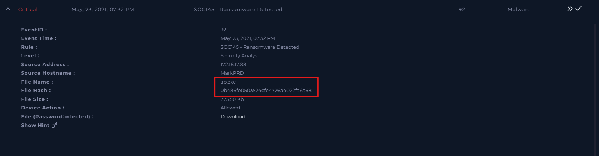
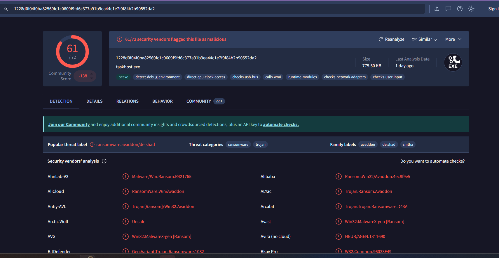
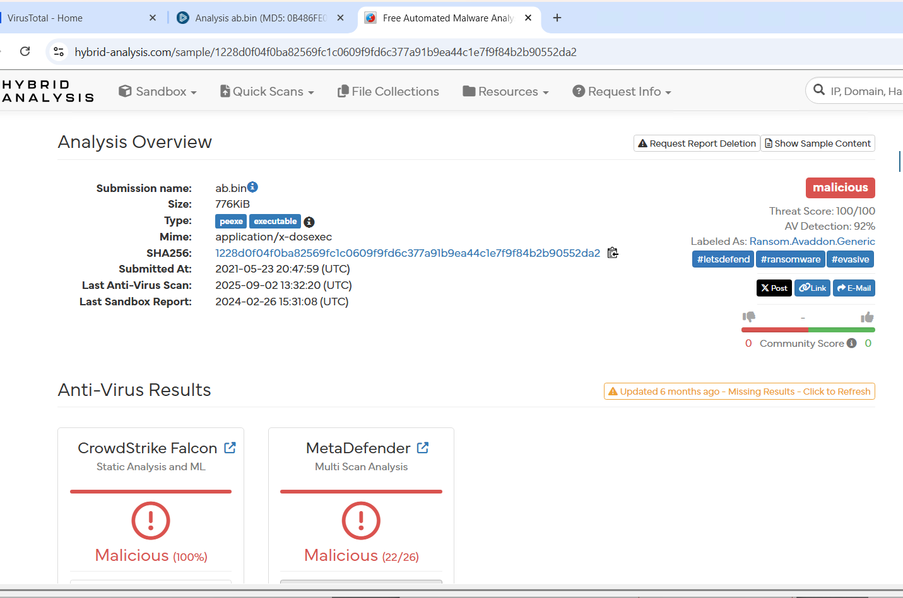
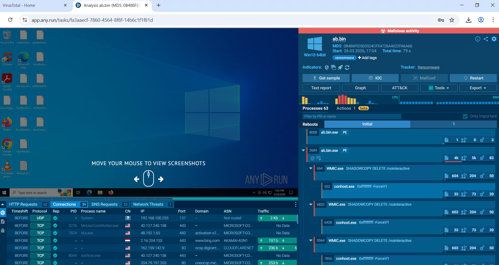
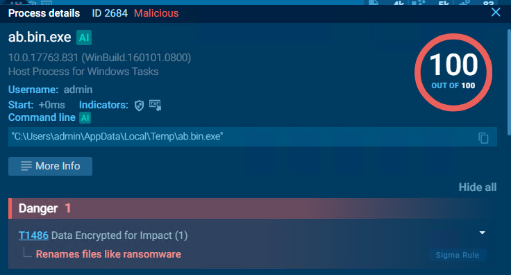
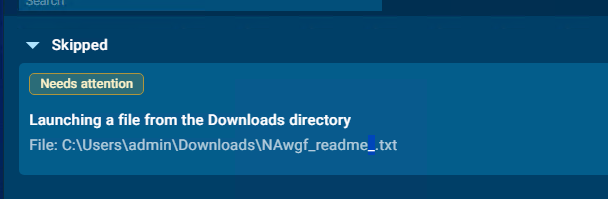
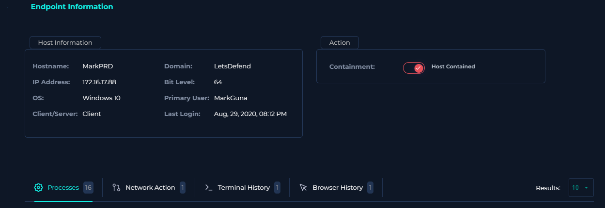

# SOC145 - Ransomware Detected

**Malware Analysis & Endpoint Investigation | LetsDefend SOC Simulator**

[](https://app.letsdefend.io/)
[](#)
[](#)
[](#)

---

## 🎯 Case Overview

**Case ID:** SOC145  
**Alert Type:** Ransomware Detected  
**Date:** May 23, 2021, 07:32 PM  
**Severity:** High  
**Verdict:** True Positive — Ransomware Confirmed, Host Compromised & Contained

**Executive Summary:**

A high-severity ransomware alert was triggered when endpoint `172.16.17.88` downloaded and executed a binary named `ab.bin`. The file was confirmed malicious across VirusTotal, Hybrid Analysis, and ANY.RUN — identified as **Avaddon Ransomware**. The malware deleted shadow copies, encrypted user files (appending `.aABBBabeAC`), and dropped a ransom note (`NAwgf_readme_.txt`). No C2 communication was observed. The endpoint was immediately contained and the case escalated to L2.

---

## 📊 Attack Chain Analysis

```
1. File Download
   └─ Victim IP: 172.16.17.88
   └─ File: ab.bin (inside a .zip)
   └─ MD5: 0b486fe0503524cfe4726a4022fa6a68

2. Execution
   └─ ab.bin executed from C:\Users\admin\AppData\Local\Temp\
   └─ Masquerades as taskhost.exe (Microsoft signing metadata spoofed)

3. Defense Evasion — Shadow Copy Deletion
   └─ wmic SHADOWCOPY DELETE /nointeractive
   └─ vssadmin Delete Shadows /All /Quiet
   └─ wbadmin DELETE SYSTEMSTATEBACKUP

4. Encryption
   └─ Files renamed → random strings + .aABBBabeAC extension
   └─ Ransom note dropped: NAwgf_readme_.txt (across all directories)

5. Persistence
   └─ ab.bin copied to AppData\Roaming\Microsoft\Windows\ab.bin.exe
   └─ Executed via Task Scheduler

6. No C2 / No Exfiltration Observed (in sandbox)
   └─ Onion URL referenced in ransom note: avaddongun7rngel.onion
   └─ Endpoint contained — escalated to L2
```

---

## 🔍 Investigation Methodology

### Phase 1: Alert Triage



| Field | Value |
|-------|-------|
| **Rule Triggered** | SOC145 - Ransomware Detected |
| **Date** | May 23, 2021, 07:32 PM |
| **Victim IP** | 172.16.17.88 |
| **Malicious File** | ab.bin |
| **File Hash (MD5)** | `0b486fe0503524cfe4726a4022fa6a68` |

---

### Phase 2: Static Analysis — VirusTotal & Hybrid Analysis





| Hash | Value |
|------|-------|
| **MD5** | `0b486fe0503524cfe4726a4022fa6a68` |
| **SHA1** | `297DEA71D489768CE45D23B0F8A45424B469AB00` |
| **SHA256** | `1228D0F04F0BA82569FC1C0609F9FD6C377A91B9EA44C1E7F9F84B2B90552DA2` |

All three platforms confirmed the file as **malicious ransomware**. The URL from which the file was downloaded was also flagged on VirusTotal.

---

### Phase 3: Dynamic Analysis — ANY.RUN Sandbox







**Key Sandbox Behaviors:**

- `ab.bin.exe` (PID 2684) ran from Temp directory — spawned multiple `WMIC.exe` instances to destroy shadow copies
- Files renamed with `.aABBBabeAC` extension across Desktop, Documents, Pictures, Downloads
- Ransom note `NAwgf_readme_.txt` dropped in every accessible directory
- Executable copied itself to `AppData\Roaming\Microsoft\Windows\` for persistence via Task Scheduler
- Registry modified: `EnableLUA = 0`, `ConsentPromptBehaviorAdmin = 0` (UAC disabled)
- **No network C2 connections** — all network traffic in sandbox was whitelisted Microsoft services

**Ransom Note Content (Summary):**
> Files encrypted with `.aABBBabeAC` extension. Payment demanded in exchange for decryption key. Threat to publish stolen data. Contact via Tor: `avaddongun7rngel.onion`

---

### Phase 4: Endpoint Investigation



The endpoint had **no EDR agent installed**, meaning terminal and browser logs were unavailable for direct review. Based on sandbox analysis and alert data:

| Check | Finding |
|-------|---------|
| Shadow copies | Deleted by WMIC / vssadmin / wbadmin |
| File encryption | Confirmed — `.aABBBabeAC` extensions observed |
| C2 connections | None observed |
| Persistence | Task Scheduler entry established |
| Containment | Host isolated immediately |

**Endpoint contained → Case escalated to L2 analyst.**

---

## 🧠 What Is Avaddon Ransomware?

Avaddon is a ransomware-as-a-service (RaaS) family that operated from 2020 until mid-2021 when it abruptly shut down and released decryption keys. It targeted organizations globally with double-extortion tactics — encrypting files AND threatening to leak stolen data if the ransom was unpaid.

**Typical Avaddon Behaviors:**
- Deletes Volume Shadow Copies before encryption
- Disables UAC via registry modifications
- Appends random extensions to encrypted files
- Drops ransom notes in every accessible folder
- References a Tor-based payment/leak site

## 🗺️ MITRE ATT&CK Threat Mapping

Mapped from analysis of sample activity — 4 tactics, 6 technique instances identified.

---

### ⚡ Execution — TA0002


---

### 🔐 Persistence — TA0003


---

### 🛡️ Defense Evasion — TA0005


---

### 💥 Impact — TA0040


---

## 📊 Technique Details

| Tactic | Technique | Description |
|--------|-----------|-------------|
| **Execution** | T1059 — Command & Scripting Interpreter | WMIC used to delete shadow copies |
| **Persistence** | T1053 — Scheduled Task/Job | `ab.bin` persisted via Task Scheduler |
| **Defense Evasion** | T1548 — Abuse Elevation Control | UAC disabled via registry |
| **Defense Evasion** | T1036 — Masquerading | Binary spoofed as `taskhost.exe` |
| **Impact** | T1490 — Inhibit System Recovery | Shadow copies and backups deleted |
| **Impact** | T1486 — Data Encrypted for Impact | Files encrypted with `.aABBBabeAC` extension |

---

### 🧾 Legend


## 📋 Investigation Summary

### Timeline of Events
```
May 23, 2021
07:32 PM — Alert triggered: SOC145 - Ransomware Detected on 172.16.17.88
           ab.bin downloaded and executed from Temp directory
           WMIC spawns → shadow copies destroyed
           Files encrypted → .aABBBabeAC extension appended
           Ransom note (NAwgf_readme_.txt) dropped across directories
           Persistence established via Task Scheduler
XX:XX PM — Analyst triages alert, submits hash to VirusTotal / Hybrid Analysis
XX:XX PM — ANY.RUN sandbox detonation confirms Avaddon ransomware
XX:XX PM — No C2 connections confirmed; onion URL noted as IOC
XX:XX PM — Endpoint contained; escalated to L2 analyst
```

### Indicators of Compromise (IOCs)

```
File:           ab.bin / ab.bin.exe
MD5:            0b486fe0503524cfe4726a4022fa6a68
SHA1:           297DEA71D489768CE45D23B0F8A45424B469AB00
SHA256:         1228d0f04f0ba82569fc1c0609f9fd6c377a91b9ea44c1e7f9f84b2b90552da2
Ransom Note:    NAwgf_readme_.txt
File Extension: .aABBBabeAC
Onion URL:      avaddongun7rngel.onion
Victim IP:      172.16.17.88
Persistence:    C:\Users\admin\AppData\Roaming\Microsoft\Windows\ab.bin.exe
```

---

## 🎯 Remediation Actions Taken

✅ **Endpoint Contained**
- Host isolated from network to prevent lateral ransomware spread

✅ **Escalated to L2**
- Incident handed off with full IOC list and sandbox analysis

✅ **Recommended Follow-Up**
- Restore from clean backup (pre-infection snapshot, if available)
- Block file hash and onion domain at perimeter
- Audit all endpoints for `.aABBBabeAC` encrypted files
- Enforce EDR agent deployment across all endpoints
- User awareness training on suspicious downloads

---

## 💼 Skills Demonstrated

✅ **Alert Triage** — Rapid identification of ransomware IOCs from initial alert data

✅ **Static Malware Analysis** — Hash verification across VirusTotal and Hybrid Analysis

✅ **Dynamic Sandbox Analysis** — ANY.RUN detonation revealing full execution chain, file encryption, shadow copy deletion, and ransom note drop

✅ **Ransomware Identification** — Attribution to Avaddon RaaS based on behavioral fingerprint and onion URL

✅ **Verdict & Escalation** — Correct True Positive classification with immediate containment and L2 escalation

---

## 🛠️ Tools & Technologies Used

| Category | Tools |
|----------|-------|
| **Investigation Platform** | LetsDefend SOC Simulator |
| **Static Analysis** | VirusTotal, Hybrid Analysis |
| **Dynamic Analysis** | ANY.RUN Interactive Sandbox |
| **Threat Framework** | MITRE ATT&CK |

---

## 📖 Case Documentation

**Platform:** LetsDefend  
**Case Number:** SOC145  
**Alert Date:** May 23, 2021, 07:32 PM  
**Analyst:** Kanhay Thakore  
**Verdict:** ✅ True Positive — Host Compromised, Contained & Escalated to L2  
**Status:** Closed

---

## 📧 Contact

**Kanhay Thakore**  
SOC Analyst | Malware Analysis | Threat Detection | Incident Response

[](https://www.linkedin.com/in/kanhaythakore/)
[](mailto:thakorekanhay70@gmail.com)

---

## 📄 Disclaimer

This case was investigated on the LetsDefend training platform as part of cybersecurity education. All indicators, IOCs, and artifacts are from a simulated SOC environment. No real organizations or systems were compromised.

---

⭐ **If you found this case analysis valuable, please give it a star!**

*Last Updated: 2026*
